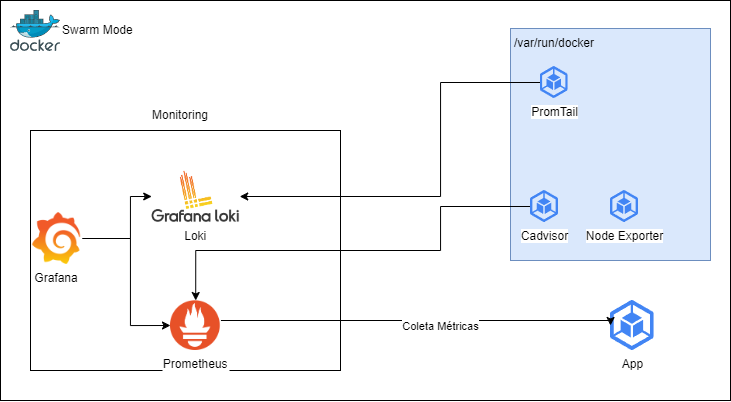

# Infraestrutura

Neste cenário, utilizamos alguns recursos, são eles:

- Aplicação
- Grafana
- Promtail
- Loki
- Prometheus
- Node Exporter
- Cadivisor



## Aplicação

## Observabilidade

### Loki e Promtail

Optado por utilizar o Loki como datasource de logs pela facilidade e integração local. Para utilizaçõa local, não é necessário muitos ajustes, apenas apontar todos os serviços para se conectar localmente (Uma única instância, então deve inicializar com `127.0.0.1`).

````yaml
      -config.file=/etc/loki/local-config.yaml
      -boltdb.shipper.compactor.ring.instance-addr=127.0.0.1
      -distributor.ring.instance-addr=127.0.0.1
      -frontend.instance-addr=127.0.0.1
      -index-gateway.ring.instance-addr=127.0.0.1
      -ingester.lifecycler.addr=127.0.0.1
      -query-scheduler.ring.instance-addr=127.0.0.1
      -ruler.ring.instance-addr=127.0.0.1
````

Para o promtail, é necessário se atentar para que seja montado o volume o socket do docker:

````yaml
    volumes:
      - /var/run/docker.sock:/var/run/docker.sock
      - /var/lib/docker/containers:/var/lib/docker/containers:ro
````

### Grafana

### Prometheus e Exporters
