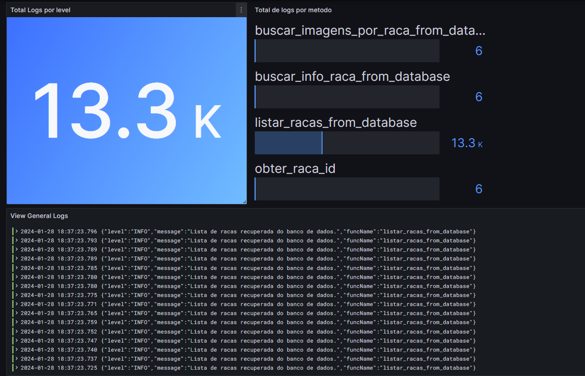
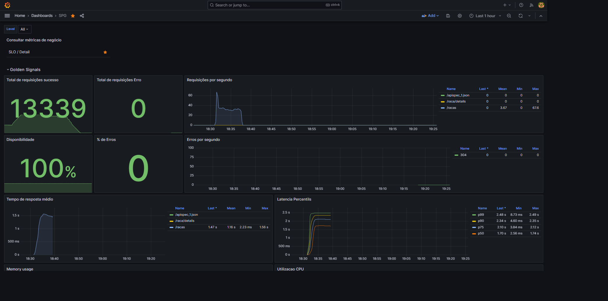
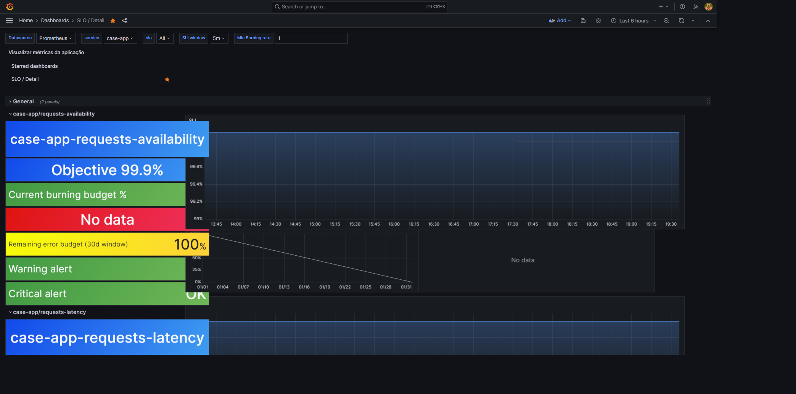

# Observabilidade

Pilares utilizados neste cenário: Logs e Métricas

## Logs

Para os logs, utilizei a estratégia de coleta com o Promtail e o Loki para o armazenamento.
Dessa forma, só precisamos nos preocupar na aplicação para expor os logs no stdout do container e em formato apropriado (Neste cenário em .json).



Query utilizada:

````shell
{service="case-app"} |= `` | json | __error__=``| line_format "{\"level\":\"{{.levelname}}\",\"message\":\"{{.message}}\",\"funcName\":\"{{.funcName}}\"}" | json | level=~"$level"
````

## Métricas

Para as métricas, foi utilizado o Prometheus e mais dois componentes para métricas de infraestrutura para o docker local: Node Exporter e Cadivisor - Com eles além das métricas da aplicação que foi exportada, temos também as métricas do docker.



No flask, foi utilizado a biblioteca `prometheus_flask_exporter` que já gera as métricas das rotas registradas do Flask, facilitando a instrumentação e padronização das métricas.

## SLO/SLI

Adicionalmente, configurei dois SLOS, relacionados a Erros e Latência, para isso foi adicionado as records no [prometheus](../infra/configs/prometheus/recording-rules.yml).

Para gerar as rules e a Dashboard, foi utilizado o [Sloth](https://sloth.dev), que já gera a partir de um [spec](../infra/configs/prometheus/slo-spec.yaml) todas as rules necessárias.
Assim como a dashboard padrão já gerada pelo Sloth, que também pode ser personalizada.



As considerações do SLI foram:

Configurações do SLI:

- `requests-availability`
  - Esse SLO nos mostra que estamos retornando as requisições com sucesso aos clientes
  - SLI error: Vamos considerar um event de erro as requisições com códigos >=500
  - SLO objective (99.9%): Manter padrão dos 3 noves (Ser avaliado em negócio).
- `requests-latency`
  - Este SLO nos mostra as requisições que estão sendo lentas e afetando nossos clientes
  - SLI error: Nos vamos considerar um evento as respostas que tiverem a latência <1000ms.
  - SLO objective(99%): Neste caso, manteremos apenas o objetivo em 99% para a latencia.

## Dashboards

Todas as dashboards criadas, estão localizadas no diretório [/infra/configs/grafana/dashboards](../infra/configs/grafana/dashboards) e podem ser importadas via json, caso não seja montado automático.
