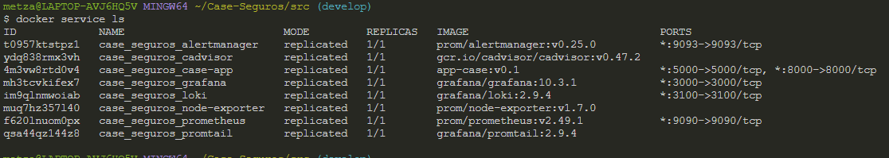
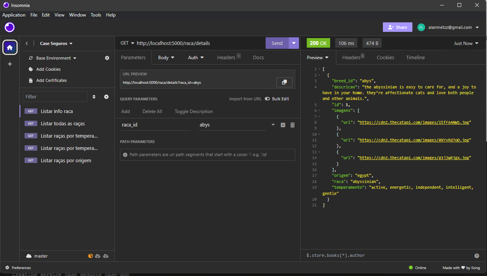

# Como subir uma cópia localmente?

Para replicar o projeto localmente, devemos seguir alguns passos.

## Pré requisitos

- Docker
- Insomnia ou Postman

## Passos

Podemos iniciar gerando a imagem da aplicação na pasta `src`:

````shell
cd src
docker build -t app-case:v0.1 .
````

Necessário agora no arquivo de [docker-compose](../infra/docker-compose.yaml) ajustar as variáveis `THECATAPI_API_KEY` caso possuir, e `INITIAL_FLOW_CATS` para `TRUE`, caso seja a primeira inicialização para que seja iniciado carregado os dados da integração da The Cats API.

Após gerar a imagem da aplicação, podemos iniciar a nossa stack local a partir do compose-file:

````shell
docker stack deploy --compose-file ../infra/docker-compose.yaml case_seguros
````

Após isso, os serviços já devem estar disponíveis e poderão ser visualizados:


Após isso já será possível utilizar os componentes do ambiente:

- API: [`http://localhost:5000`](http://localhost:5000)
- Grafana: [`http://localhost:3000`](http://localhost:3000)

## Utilização da API

Para consultar a documentação da API, acessar o endereço `http://localhost:5000/apidocs/`, onde está documentado as 3 rotas existentes e quais os seus parâmetros, além de exemplos de respostas esperadas. Está utilizando do Swagger na versão 2.0.

Neste repositório, está disponibilizado script para as requisições da API, para que seja explorado pelo [Insomnia](../test-api-files/Insomnia_Test.yaml).


